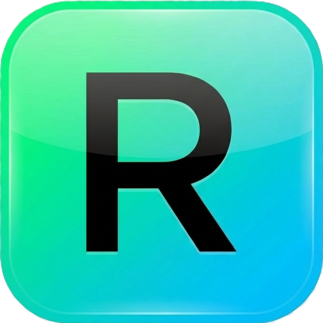
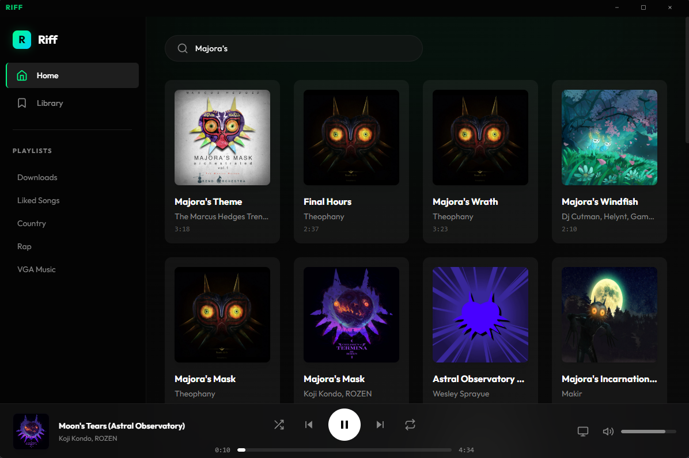
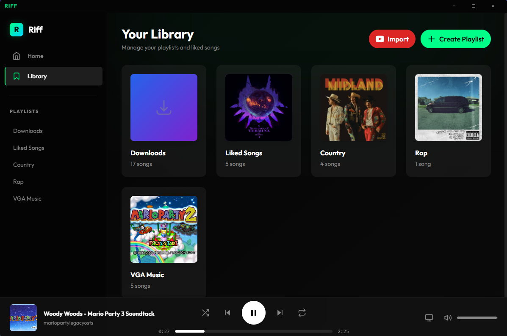
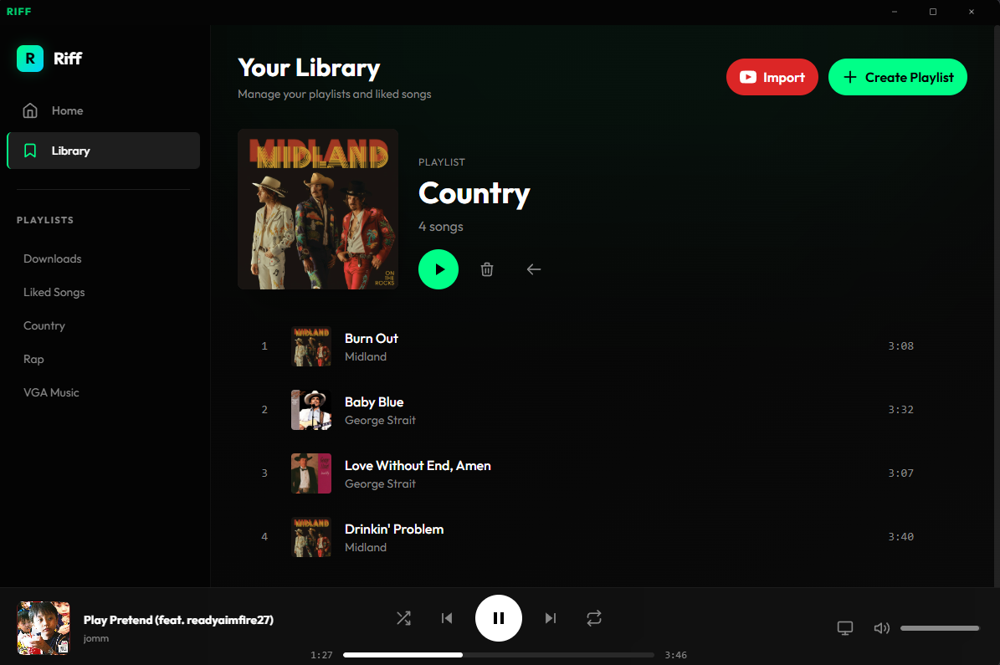

# Riff 

> A modern, sleek desktop music player that lets you search, organize, and download your favorite tracks locally. Built with Electron and styled for a premium user experience.

## Overview

Riff is a desktop application designed to bridge the gap between streaming and offline playback. It allows you to search for songs using the Spotify API, organize them into playlists, and automatically download them for offline listening. With a beautiful glassmorphism-inspired interface, dark mode support, and smooth animations, Riff offers a premium music experience on your desktop.

## ✨ Features

- **Search & Discover**: Access the vast library of songs via Spotify search integration.
- **Offline Downloads**: Automatically download tracks to your local machine for offline playback.
- **Smart Playlists**: 
  - **Liked Songs**: Quickly save your favorites.
  - **Downloads**: Auto-managed playlist of all your offline tracks.
  - **Custom Playlists**: Create and organize your own collections.
- **Customization**:
  - **Custom Covers**: Set your own images for playlists or let Riff auto-select the album art from the first track.
  - **Themes**: Built-in dark mode with aesthetic gradients and transparency effects.
- **Seamless Playback**: Background playback, queue management, and immediate local file streaming.

## 📸 Screenshots

| Home View | Library View |
|:---:|:---:|
|  |  |
| *Home & Search* | *Your Library* |

| Playlist View |
|:---:|
|  |
| *Custom Playlists* |

## 🚀 Getting Started

### Prerequisites

- [Node.js](https://nodejs.org/) (v16 or higher recommended)
- [Git](https://git-scm.com/)

### Installation

1. **Clone the repository**
   ```bash
   git clone https://github.com/Drewe4401/Riff.git
   cd Riff
   ```

2. **Install dependencies**
   ```bash
   npm install
   ```
   *Note: This will also install necessary build tools via electron-builder.*

3. **Run the application**
   ```bash
   npm start
   ```

## 🛠️ Configuration

Riff uses the Spotify API for finding metadata. By default, it includes pre-configured credentials for testing. 

To use your own credentials (recommended for forks or production use):
1. Go to the [Spotify Developer Dashboard](https://developer.spotify.com/dashboard/) and create an app.
2. Create a `.env` file in the root directory.
3. Add your credentials:
   ```
   SPOTIFY_CLIENT_ID=your_client_id_here
   SPOTIFY_CLIENT_SECRET=your_client_secret_here
   ```

## 📦 Building

To build the executable for Windows:

```bash
npm run dist
```

This will generate an installer and an unpacked executable in the `dist/` directory.

## 🔧 Technology Stack

- **Core**: [Electron](https://www.electronjs.org/)
- **Styling**: [Tailwind CSS](https://tailwindcss.com/)
- **Backend Logic**: Node.js & Electron IPC
- **Audio source**: `yt-dlp` (for downloads) & Spotify API (for metadata)

## 🤝 Contributing

Contributions are welcome! Please feel free to submit a Pull Request.

1. Fork the project
2. Create your feature branch (`git checkout -b feature/AmazingFeature`)
3. Commit your changes (`git commit -m 'Add some AmazingFeature'`)
4. Push to the branch (`git push origin feature/AmazingFeature`)
5. Open a Pull Request

## 📄 License

This project is licensed under the ISC License.

---

<p align="center">
  Made with ❤️ by Drewe
</p>
