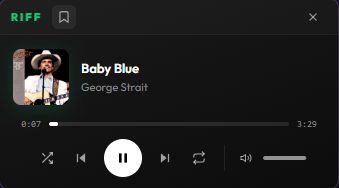
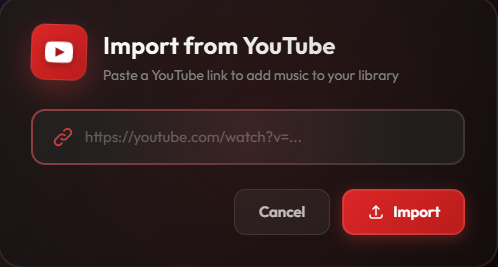
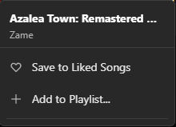
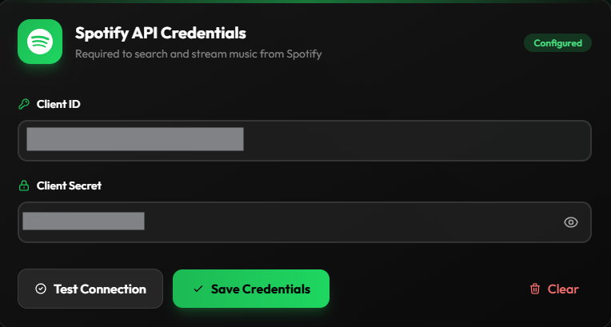

# Riff

> A modern, sleek desktop music player that lets you search, organize, and download your favorite tracks locally. Built with Electron and styled for a premium user experience.

## Overview

Riff is a desktop application designed to bridge the gap between streaming and offline playback. Search for songs using the Spotify API, organize them into playlists, and automatically download them for offline listening. With a beautiful glassmorphism-inspired interface, dark mode support, and smooth animations, Riff offers a premium music experience on your desktop.

> ⚡ **Quick Start**: After installation, you'll need to add your own [Spotify API credentials](#-spotify-api-setup-required) (free, takes 2 minutes).

## 🆕 What's New in v1.1.1
# v1.1.1 (2026-01-10)

## 🐛 Bug Fixes
- **Context Menu**: Fixed an issue where the "Remove from Playlist" button displayed duplicate text and an incorrect playlist name in the right-click context menu.

## 📸 Screenshots

| Home View | Library View |
|:---:|:---:|
|  |  |
| *Home & Search* | *Your Library* |

| Playlist View | Miniplayer |
|:---:|:---:|
|  |  |
| *Custom Playlists* | *Compact Miniplayer* |

| YouTube Import | Context Menu |
|:---:|:---:|
|  |  |
| *Direct YouTube Download* | *Right-Click Controls* |

| Settings |
|:---:|
|  |
| *Spotify API Configuration* |

## 🚀 Getting Started

### Prerequisites

- [Node.js](https://nodejs.org/) (v16 or higher recommended)
- [Git](https://git-scm.com/)

### Installation

1. **Clone the repository**
   ```bash
   git clone https://github.com/Drewe4401/Riff.git
   cd Riff
   ```

2. **Install dependencies**
   ```bash
   npm install
   ```
   *Note: This will also install necessary build tools via electron-builder.*

3. **Run the application**
   ```bash
   npm start
   ```

## 🔐 Spotify API Setup (Required)

Riff requires your own Spotify API credentials to function. This is a **one-time setup** that takes about 2 minutes.

<p align="center">
  
  <br/>
  <em>Configure your credentials in the Settings panel</em>
</p>

### Why do I need my own credentials?

Riff uses the Spotify API to search for songs and retrieve metadata (album art, artist info, etc.). By using your own credentials, you ensure:
- ✅ **Privacy**: Your listening data stays with your own Spotify Developer account
- ✅ **Reliability**: No shared rate limits with other users
- ✅ **Control**: Full ownership of your API access

### Step-by-Step Setup

#### 1️⃣ Create a Spotify Developer Account
1. Go to the [Spotify Developer Dashboard](https://developer.spotify.com/dashboard/)
2. Log in with your existing Spotify account (or create one for free)

#### 2️⃣ Create a New App
1. Click **"Create App"**
2. Fill in the required fields:
   - **App name**: `Riff Player` (or anything you prefer)
   - **App description**: `Personal music player`
   - **Redirect URI**: `http://localhost:3000` (required but not used)
3. Accept the terms and click **"Save"**

#### 3️⃣ Get Your Credentials
1. In your new app's dashboard, you'll see your **Client ID**
2. Click **"View client secret"** to reveal your **Client Secret**
3. Copy both values

#### 4️⃣ Configure Riff
1. Launch Riff
2. Click **Settings** (gear icon in the sidebar)
3. Paste your **Client ID** and **Client Secret** into the form
4. Click **"Test Connection"** to verify your credentials work
5. Once verified, click **"Save Credentials"**

> ✨ **That's it!** You're ready to start searching and downloading music.

### Security Note

🔒 Your credentials are stored **locally on your device** in an encrypted format. They are never sent anywhere except directly to Spotify's authentication servers.

---

## 📦 Building

To build the executable for Windows:

```bash
npm run dist
```

This will generate an installer and an unpacked executable in the `dist/` directory.

## 🔧 Technology Stack

- **Core**: [Electron](https://www.electronjs.org/)
- **Styling**: [Tailwind CSS](https://tailwindcss.com/)
- **Backend Logic**: Node.js & Electron IPC
- **Audio source**: `yt-dlp` (for downloads) & Spotify API (for metadata)

## 🤝 Contributing

Contributions are welcome! Please feel free to submit a Pull Request.

1. Fork the project
2. Create your feature branch (`git checkout -b feature/AmazingFeature`)
3. Commit your changes (`git commit -m 'Add some AmazingFeature'`)
4. Push to the branch (`git push origin feature/AmazingFeature`)
5. Open a Pull Request

## 📄 License

This project is licensed under the ISC License.

---

<p align="center">
  Made with ❤️ by Drewe
</p>
